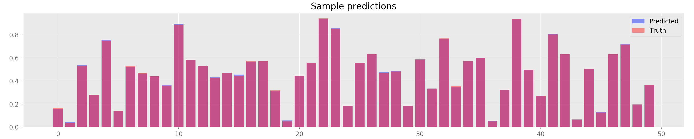
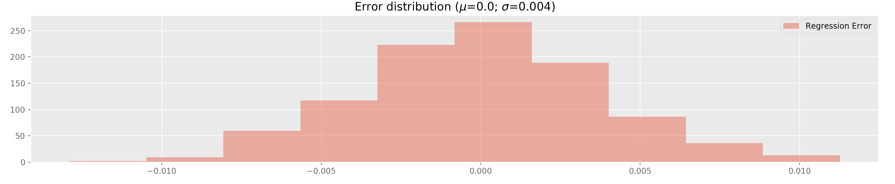
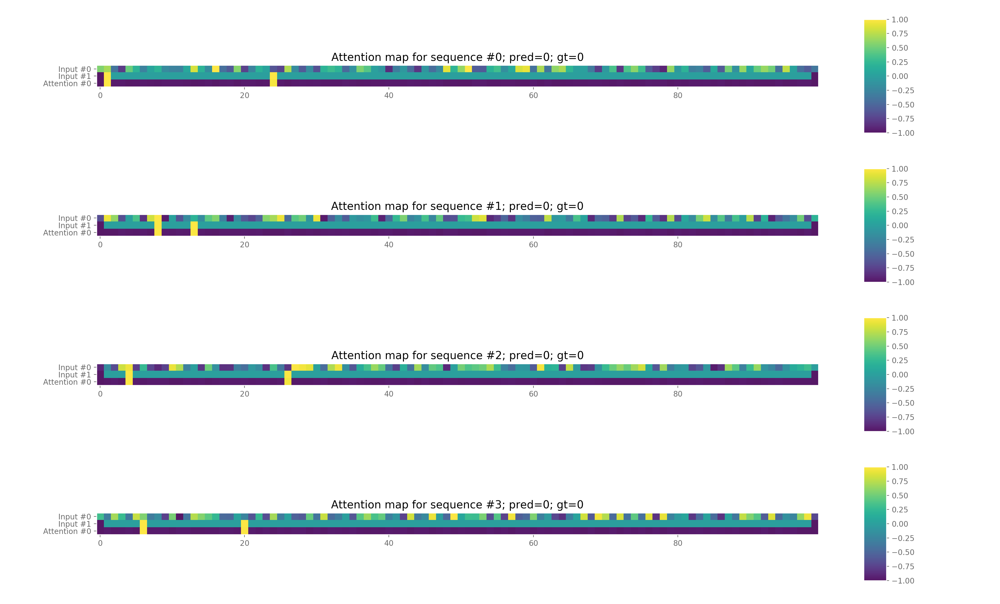
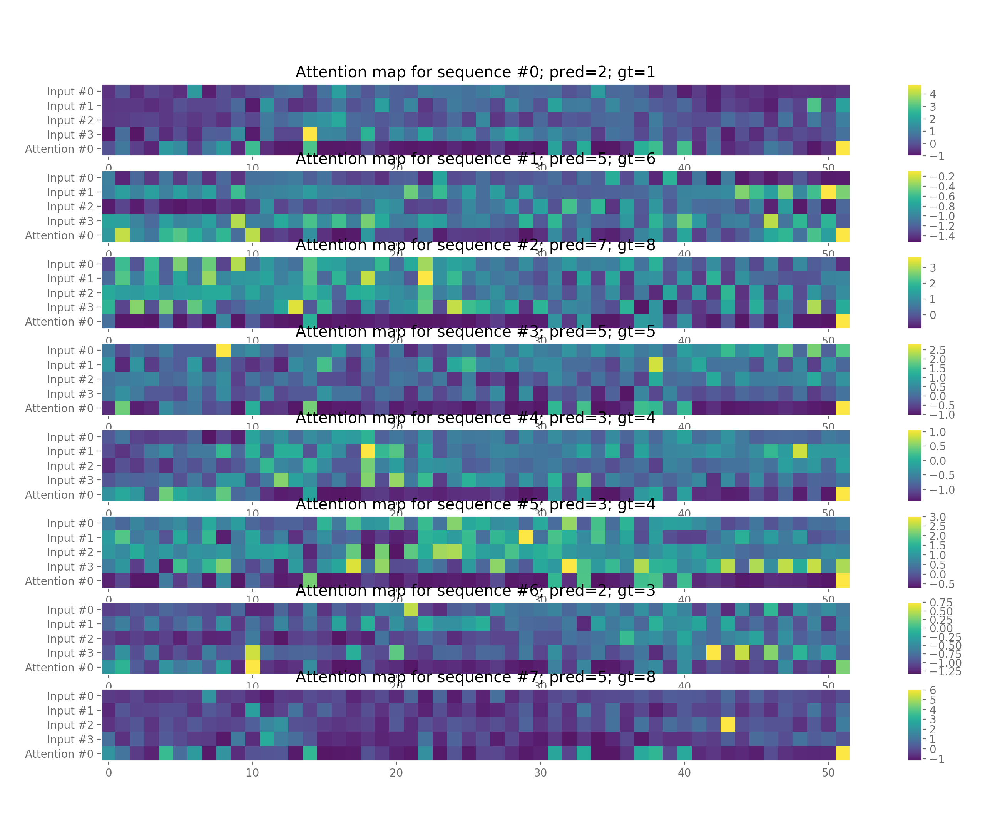
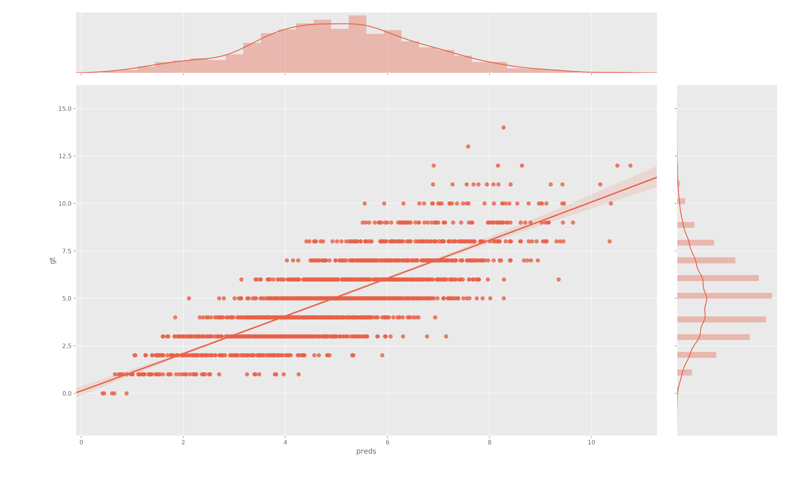
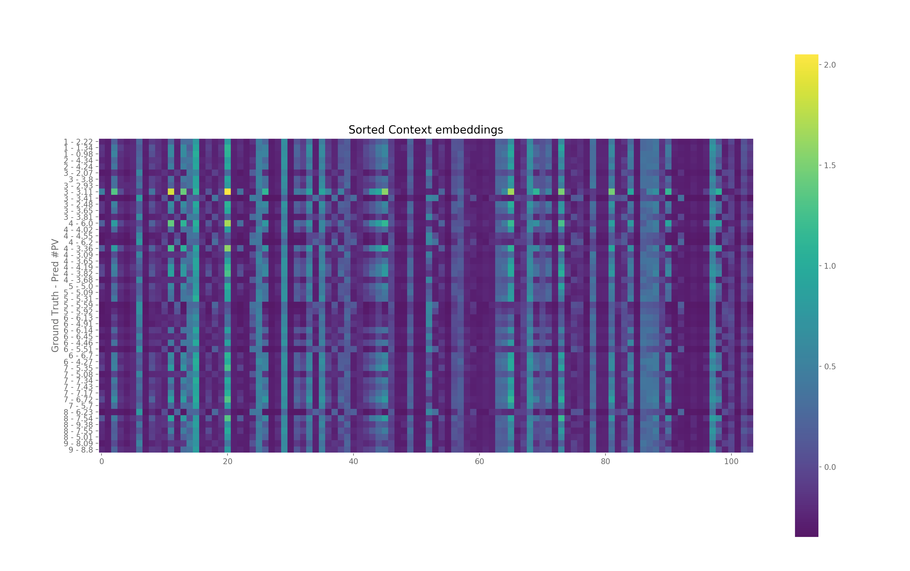

# Feed-Forward Attention

PyTorch implementation of the Feed-Forward Attention Mechanism.

This is based on work by Colin Raffel and Daniel P. Ellis, *Feed-Forward Networks with Attention Can Solve Some Long-Term Memory Problems* (https://arxiv.org/abs/1512.08756)

## Usage

### Subclassing FFAttention

The main class has been implemented as the `FFAttention` class. You can subclass this to use in your own problems. The learning is done sequentially, with five methods forming the `forward` pass of the algorithm. You will need to implement some of them.

1. `embedding` (*not implemented*) : computes embeddings $$h_t$$ for element of sequence $$x_t$$. 
2. `activation` (*not implemented*) : computes the embedding activations $$e_t$$.
3. `attention` (*Already implemented*) : computes the probabilities $$\alpha_t$$.
4. `context` (*Already implemented*) : computes the context vector $c$.
5. `out` (*not implemented*) : Feed-forward prediction.

Note that you can reimplement or extend any of the other methods, for logging purposes for example.

### Data

Typical pipelines include data processing steps. In the examples provided, several steps are separated. Loading and saving is done manually. Feel free to dump to pickle files pre-processed data and reload it.

Feed this data to the algorithm is done by implementing a custom PyTorch `Dataset` class. See the examples to see how to use this.

### Data visualisation

Several plotting utilities are available in `utils.py`:

#### `plot_loss`

#### `plot_predictions`

#### `plot_error`

#### `plot_attention`

#### `plot_confusion`

#### `plot_context`

### Attention log

A utility to track the algorithm's progress in provided in the form of a logger object. It is easy to extend this object with new fields. A standard architecture is provided here. Note that the plotting utilities do depend on the presence of some fields for some plots so it is recommended to extend the object not re-implement it. 